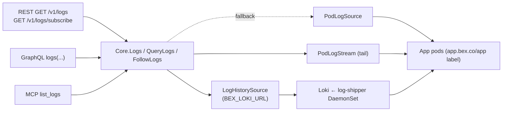
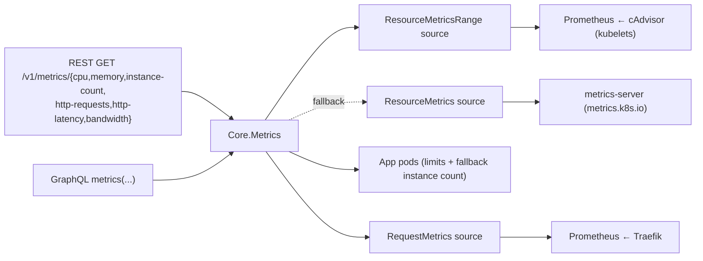

# Observability — logs and metrics

bex makes a running platform **observable** without `kubectl`: an operator or an AI agent debugging a deploy reaches App logs and metrics through the same bearer-authed [bex-api](ADR006-bex-api.md) it uses for lifecycle verbs. This is `GOAL.md` #2 ("basic obs for operation") and the AI-native pillar in [ADR008-vision.md](ADR008-vision.md) — agents can't fix a failing deploy they can't read.

Logs shipped first: highest operational value, and the simplest backend (pod logs, no metrics-server dependency). Metrics follow, over the same one-Core-many-adapters shape.

## Logs

One `Core` logs read, three adapters — the [bex-api](ADR006-bex-api.md) invariant. The MCP `list_logs` tool is the agent surface; REST and GraphQL expose the same read to the public API and dashboard.



- **`Core.Logs(name, tail)`** — tail-N aggregation across replicas; the unfiltered convenience read. Returns `LogEntry{timestamp, message, labels}` (labels `service`/`instance`/`container`).
- **`Core.QueryLogs(LogQuery)`** — adds Render's filters and paging; the read path all three adapters (REST, GraphQL, MCP `list_logs`) go through. A `dpg-…` resource dispatches to the Database-authorized Postgres path (w3/m28); a `red-…` resource dispatches to the KeyValue-authorized Valkey path (w3/m30). Both preserve the same public operation.
- **`Core.FollowLogs(LogQuery, emit)`** — live tail; the SSE stream.

Two backends sit behind the read verbs, each an injected source so the domain stays clientset/HTTP-free (like `PodLogSource`, both are faked in tests with no cluster):

- **`LogHistorySource`** (`NewLokiSource`, gated by `BEX_LOKI_URL`) — the **durable** backend `Core.QueryLogs`/`Logs` prefer when wired. It translates the authorized `LogQuery` into a LogQL `query_range`: `{namespace, app}` for services or `{namespace, database}` for managed Postgres, plus text, time, instance, and limit. Alloy feeds both sources. This is what makes logs **survive a pod restart**: pre-restart App and CNPG lines remain searchable.
- **`PodLogSource`** (`NewPodLogSource`) — the **live fallback** for `QueryLogs`/`Logs` when `BEX_LOKI_URL` is unset: reads the kubelet's `pods/log` ring buffer directly (the one subresource controller-runtime's client can't serve). Apps select `app.bex.co/app` and container `app`; Postgres selects exact `cnpg.io/cluster=<dpg-id>` and container `postgres`; Key Value selects `app.bex.co/keyvalue=<red-id>` and container `valkey`. No history — a restart loses the buffer — but zero extra infrastructure.

`PodLogSource`/`PodLogStream` live in `podlogs.go`; `LogHistorySource` in `loki.go`. All three are injected in `cmd/api/main.go`.

### The tail reads pod logs, not Loki

`Core.FollowLogs` (the `GET /v1/logs/subscribe` SSE stream) **always reads `PodLogStream` (pod logs), never Loki — even when Loki is wired.** The default/App tail follows the App containers; an explicit `type=build` follows the newest running build pod in `BEX_BUILD_NAMESPACE` (BuildKit, signed BuildKit, or kpack, with running container names discovered from Pod status). The tail is for new lines going forward, where following the kubelet stream directly is real-time with zero ingest lag, adds no moving parts, and — critically — **does not die when Loki is down**: history degrades to the live buffer, the tail is unaffected. Loki's own tail endpoint would give a single history+tail source at the cost of a small ingest lag and a new failure mode on the live path; the durability win is on the _historical query_ (`QueryLogs`), which Loki already owns, so the tail stays on pods. The one accepted consequence: a freshly-restarted pod's tail starts from that pod's new buffer — but the pre-restart lines are served by `QueryLogs` from Loki, so nothing is actually lost.

### Durability & retention

Loki keeps **21 days** of searchable history (`limits_config.retention_period: 504h`, compactor-enforced) — enough for the ADR055 registry/static identity migration's 14-day clean window plus an evaluation buffer (`w2/m93`, [runbooks/registry-static-identity-migration.md](runbooks/registry-static-identity-migration.md) Phase 4). Render's searchable window is tiered by plan — Hobby 7 days, Pro 14, Scale/Enterprise 30 — so 21 days sits inside the Pro/Scale range; lowering back toward the Hobby floor is one knob (`retention_period` in `deploy/gitops/base/loki.yaml`, plus the PVC size) once Phase 4 closes. Loki runs **single-binary on a filesystem PVC** (no object store) — the same posture as Prometheus's PV and the etcd/OpenBao Raft volumes: history survives a **pod restart** because it's on a real PV. On prod the PVC rides the cluster's default `hcloud-volumes` StorageClass (a Hetzner Cloud Volume — a network volume that survives a node rebuild/loss), so a node going away does _not_ lose the history; the disposable CAPD mock uses `local-path` (node-local), where a node loss _does_ lose it. Cross-host log durability beyond one volume's lifecycle would mean an object-store backend, deferred like the others. The local overlay shrinks the PVC to CAPD scale (`2Gi`) since the mock cluster is disposable. The same durability covers tenant-node replacement (autoscaler scale-down/up churn), not just a crash: the log-shipper DaemonSet tolerates every taint so it ships from any node the autoscaler adds, and the hcloud volume follows Loki's pod to whichever node it's rescheduled onto — no further work needed.

### Cluster enablement

`deploy/gitops/base/loki.yaml` runs the one Loki (single-binary, filesystem PVC, 21-day retention) and `deploy/gitops/base/log-shipper.yaml` runs the Grafana **Alloy** DaemonSet that ships App (`type=app`), request (`type=request`), build, managed-Postgres (`type=postgres`), managed-Valkey Key Value (`type=keyvalue`), and platform streams (`type=platform`: dashboard UI `service=dashboard` — w4/m88; Zot registry `service=zot` in `bex-registry` and static-server `service=static-server` in `bex-system` — w2/m93 migration clean-window evidence; bex-api `service=bex-api` and the operator manager `service=operator` in `bex-system` — w7/m157, so incident evidence survives replica replacement). **Platform budget (w7/m157):** the two core services add ≈10 MB/day raw (operator zap console lines, severity parsed from the level column; bex-api's few std-log lines stay `level=unknown`) to ≈31 MB/day across all streams measured 2026-09-28, against a 20 GiB Loki volume then 1.9 GB used; retention is the shared 21-day compactor window. The selection is a closed allowlist — activator, SNI proxies, egress meter and ssh-gateway stay out, and no new label carries a tenant id. The Postgres pipeline requires the operator-stamped `app.bex.co/component=database` marker, keeps only the `postgres` container, and labels the stream with the immutable CNPG cluster/Database id; platform CNPG clusters are excluded. The Key Value pipeline selects pods whose `app.bex.co/keyvalue` label is non-empty (operator-stamped tenant Valkey pods only), keeps only the `valkey` container, and labels the stream with the `keyvalue=<red-id>` label. Platform pod logs are selected by namespace / component alone (no fake `app.bex.co/app`); they are **operator-facing** and are not part of bex-api's tenant log API. `scripts/registry-migration-readiness.sh` queries the zot/static-server streams for legacy dual-read hits. `BEX_LOKI_URL=http://loki.monitoring.svc:3100` points bex-api at it and flips historical reads from pod buffers to durable history.

### Log labels (and the cardinality budget)

A Loki **label is a stream**, so only bounded fields become labels; unbounded ones stay in the line and are filtered at query time. That single rule is the whole taxonomy:

| field | where it lives | why |
| --- | --- | --- |
| `namespace`, `app` or `database` or `service` | label | the scope of every query — equality matchers resolved after App/Database authorization for tenant streams; `service=dashboard` is the bounded platform-UI key (w4/m88), never a caller-controlled selector |
| `type` (`app`/`request`/`build`/`postgres`/`platform`) | label | bounded source vocabulary |
| `pod`, `container` | label (app/platform logs) | bounded by replica count; store `pod` projects to Render's public `instance` id (name-derived; see [ADR035](ADR035-ssh.md) / w5/m87) |
| `level` | label (app/platform logs) | 5 values, hard-capped by the shipper's normalizer (below) |
| `method` | label (request logs) | the HTTP verb set (≤8) |
| `status` | label (request logs) | the status codes an App actually returns (≤~15); Render's `statusCode` |
| **`path`**, **`host`** | **line only** | **unbounded per request** — one label per URL would mint a stream per URL |

Worst case ≈ (replicas × levels) + (methods × statuses) streams per App — low hundreds; typically under 20. `path`/`host` are still fully filterable: the access line is JSON, so a query parses them out with LogQL's `| json` stage (`request_path`/`request_host`) instead of indexing them. **Promoting `path` to a label would be a cardinality incident** — `TestPathAndHostNeverBecomeLabels` guards it.

**Request logs (`type=request`)** are Traefik's JSON access log (`logs.access` in `deploy/gitops/base/values/traefik.values.yaml`), attributed back to the App by the access line's `ServiceName` — Traefik names an Ingress-backed service `<namespace>-<service>-<port>@kubernetes`, and the operator names the k8s Service after the App CR, so the shipper reconstructs the `{namespace, app}` labels bex-api's LogQL selector queries by (namespace = `app.Namespace`, app = `app.Name`) from that name. **Tenant-namespace fix (w6/m131):** unlike the app/build/postgres pipelines — which read the namespace straight from pod metadata — the request pipeline is the one that _parses_ it out of `ServiceName`, and its regex was anchored to the literal `default`. Under ADR043 a tenant App lives in its workspace's own namespace (`tea-<xid>`) and its CR name is itself tenant-prefixed, so every real ServiceName is `tea-<xid>-tea-<xid>-<app>-<port>@kubernetes` — which the `default`-anchored regex never matched, so every tenant access line was dropped as `not_a_tenant_app` and `type=request` was silently empty for every service in production (found live, 69th `/qa-find-bugs` run). The regex now matches a `tea-<xid>` tenant namespace as well as the shared/storeless `default`; a mislabel could only ever _hide_ a line, never surface another tenant's, because bex-api pins both `namespace` and `app` to the caller's own resolved values. A line the regex can't attribute is **dropped, not guessed**, except for an explicit host allowlist (w4/m88): `RequestHost=dashboard.bex.co` is retained under the bounded labels `namespace=dashboard` + `service=dashboard` (still `type=request`); **`host` itself stays line-only**. Other non-App edge hosts (bex-api, oauth, …) remain dropped until explicitly allowlisted the same way. Request headers are dropped at the source: they carry `Authorization`/`Cookie`, and a request log is not a place to leak a credential. The message stays the raw JSON access line (every field intact and searchable) rather than a prettified summary — a divergence from Render's rendered request line, in favor of losing nothing.

**`level` on app logs is parsed, never guessed.** The shipper parses **JSON and logfmt** app lines and promotes their `level` (or `severity`) field, normalizing the spellings (`err`/`fatal`/`panic`/`critical` → `error`, `warn` → `warning`, `notice` → `info`, …) into the five buckets `error|warning|info|debug|unknown`. `warning` is Render's name, the value the pinned CLI's `--level` sends. Before w8/031 the bucket was `warn`, and a `level=warning` query matched nothing. The query side maps every Render level name onto the stored buckets (`warning` → `warning|warn`, so streams stored before the change stay findable within retention; `notice` → `info`; `critical`/`alert`/`emergency` → `error`). `unknown` stays: Render has no such value, but labelling an unclassified line as a guessed severity would be worse (decision recorded in w8/031). This includes Go's `slog.NewTextHandler` output (`time=… level=ERROR msg="request failed"`). A line without a recognized structured severity is labelled **`unknown`** — the honest answer, because bex does not know. **Substring matching is deliberately not used**: plain `ERROR …` and `msg="level=error"` remain `unknown`. bex recommends structured logging; it does not require it. `scripts/test_log_shipper.py` renders the locked Helm chart and runs its actual app pipeline in the chart's Alloy image, asserting JSON/logfmt extraction, normalization, message-only exclusions, and the five-value cardinality budget.

### Log filters

Every filter Render's logs API documents is honored, and each maps to exactly one mechanism:

| filter | mechanism | notes |
| --- | --- | --- |
| `type` | stream selection | `app` ∪ `request` ∪ `build`; default (no filter) = `app` ∪ `request` |
| `level` | label matcher | app logs; `unknown` is a real, queryable value |
| `instance` | label matcher (`pod`) after translating the public instance id (or legacy raw-name bookmark) back to an authorized pod name | app logs — a request line comes from the edge, not a replica |
| `statusCode` | label matcher (`status`) | exact (`404`) or class (`4xx`) |
| `method` | label matcher | request logs |
| `path`, `host` | `\| json` line filter | request logs; unbounded, so never labels (above) |
| `text` | line filter | case-insensitive substring, identical to the pod-log path's |
| `startTime`/`endTime` | query range |  |
| `direction` | `backward` (default) / `forward` | which end of the window `limit` keeps; the returned slice stays oldest-first either way |
| `limit` | line cap | default 20, max 100 (Render's paging range) |

Managed Postgres uses the shared time/text/direction/limit behavior plus `instance`; service/request-only filters are named 400s. Instance discovery is scoped to `{namespace, database}` in Loki and falls back to the already authorized Database's exact CNPG pod set. See the [captured contract and attribution rules](render-artifacts/postgres-logs.md). Managed Key Value (Valkey) uses the same subset; instance discovery is scoped to `{namespace, keyvalue}` in Loki and falls back to pods matching the `app.bex.co/keyvalue=<red-id>` label. Live-tail (`FollowLogs`) returns a named 400 for Key Value resources — there is no persistent Valkey connection-scoped log stream to tail.

Multiple values for one filter OR together (Render's arrays); different filters AND. A `*` wildcard is supported per value; everything else is a literal (Render also documents full regex — **bex honors the wildcard subset**, a stated divergence rather than a silent one). Every interpolated value is escaped (`%q` + `regexp.QuoteMeta`), so no service name or filter value can break out of a matcher and inject a selector — the label-injection guard, unit-tested.

**Nothing is accepted and ignored.** A filter bex cannot honor is refused where it is asked for:

- **Pod-log fallback mode** (`BEX_LOKI_URL` unset): the labels live in the store, not in a pod's stdout — so `type=request`, `type=build`, and the `level`/`statusCode`/`method`/`path`/`host` filters return **503** (`ErrLogStoreUnavailable`), rather than quietly answering a narrow question with unfiltered lines. `type=app`, `text`, `instance`, time and `direction` still work, unchanged.
- **The SSE live tail** reads pod logs by design (see above). It supports the App tail and an explicit, standalone `type=build`; it refuses request logs, mixed build types, and store-only filters with a terminal SSE `event: error` frame (its headers are already on the wire, so a status code is no longer available). A build subscription with no running build pod ends with the named `no running build is available to follow` event instead of hanging. Several `resource` values are all followed and merged onto the one stream in arrival order (w8/024; it used to follow only the first). Each resource is authorized and holds its own subscription slot before the stream opens, and the first follower to fail ends the tail with its refusal.
- **An unknown `type`, `direction` or label** is a **400** naming the value — never a silently widened query.

**Static-site request attribution (w4/m113).** A static site's `ServiceName` names the per-App ExternalName alias the operator points at the shared static server — `<ns>-bex-static-<app>-<port>@kubernetes` (production ground truth, 2026-09-19: `"ServiceName":"default-bex-static-hello-static-8080@kubernetes"`). The attribution regex therefore recovered `app=bex-static-<app>`, a name no App has, so every static access line shipped with a label bex-api's selector could never match and `type=request` was empty for every static site — with bandwidth for the same traffic correct, which is what made it look like a metrics bug rather than a logging one. Traefik already puts the answer on the line: `KubernetesIngressName` **is** the App CR name (the operator names each App's Ingress after the App), for compute services too — verified the same day against both shapes. The pipeline now prefers it and keeps the `ServiceName` regex as the fallback, gated on that regex having matched so a platform edge line (which also carries an Ingress name) still falls to the bounded host allowlist instead of the tenant branch. Both captured production lines are pinned verbatim in `shipper_attribution_test.go`.

**But "the store is up and this stream is not being produced" is not one of those refusals (w6/m131).** The rules above all key on the store being _absent_. When the store is present and healthy but a stream is silently empty — as `type=request` was for every tenant service until the attribution fix above — the query takes the success path and returns `200 {"logs":[],"hasMore":false}`, byte-identical to a genuinely quiet service. That is deliberate, and it is a limit rather than an oversight: **bex cannot distinguish the two from a single resource's vantage point.** Loki's label index is empty in both cases, so there is nothing to key on, and inventing an error would misreport every quiet service. The honest empty stays.

What closes the gap is out-of-band and platform-wide, where the distinction _is_ decidable — across every tenant app, over hours, zero request lines means the pipeline, not the traffic:

- `scripts/request-logs-liveness.sh` reads Loki's label index every 6h from `.github/workflows/ssh-edge-liveness.yml` and fails loudly (opening a tracking issue) when a tenant log pipeline has no stream **for any `tea-<xid>` tenant namespace**. The tenant qualifier is the whole point: `scripts/logs-verify.sh` exercises `APP_NS=default`, which is exactly the namespace the broken regex still matched, so it would have passed green throughout the outage. It now also asserts that the **live deployed** ConfigMap's `ServiceName` regex attributes a tenant namespace — the check that actually answers "did the GitOps change reach the running shipper?".
- **Both tenant pipelines, one probe, two issues (w3/m83 t002).** `STREAM_TYPES` defaults to `"request app"`, so the same label-index read now also asserts `type=app` — the pipeline `w3/m36` found empty for every tenant, the identical silent zero on the other side. The types stay separate all the way to the tracking issue (`request-logs-down` vs `app-logs-down`) because their remediations are unrelated: a dark request stream points at the `ServiceName` attribution regex, while the app pipeline reads its namespace straight from pod metadata, so the suspect there is the Alloy DaemonSet's reach and its `app.bex.co/app` selector. The script emits one `RESULT type=<t> status=live|dark` line per type and the workflow keys the issues off those, not off the exit code — exit `2` already means "the probe could not run", and a type the probe never reached must not open an issue on evidence nobody gathered. Build and datastore streams are deliberately out of scope, with reasons recorded in the [ADR088 §6 coverage table](ADR088-platform-observability-ui.md#tenant-facing-surface-coverage-w3m83-t001).
- `TestShipperRegex*` (`lego/backend/internal/logs/shipper_attribution_test.go`) compiles the regex out of `deploy/gitops/base/log-shipper.yaml` in CI, so the config and the query cannot drift apart again.

**Discovery must not offer what a filter cannot match (w6/m131).** `host` values come from `app.Status.URLs` rather than the store — the cardinality budget keeps `host` in the line, not in a label — which is why `host` discovery resolves even with no store wired. That is kept: it is the correct answer to "which hosts does this service serve", and with attribution fixed the `host` line filter matches exactly those values. The dashboard's static Method/Status-code/Level fallback lists are narrowed instead: they stand in for "we could not ask" (still loading, or discovery 503s with no store) and are dropped once `logLabelValues` **answers** with an empty set, so the Filters popover no longer advertises `GET·POST·PUT·PATCH·DELETE` on a service whose store says it has produced no request lines.

### REST surface

| method + path | effect |
| --- | --- |
| `GET /v1/logs` | historical query → `{hasMore, next*Time, logs}` |
| `GET /v1/logs/values` | filter-value discovery → a bare `["…"]` array |
| `GET /v1/logs/subscribe` | live tail over Server-Sent Events |
| `graphql { logs(...) }` | same query, flat `LogEntry` rows |
| `graphql { logLabelValues(...) }` | same discovery (the logs sibling of `metricsFilters`) |
| MCP `list_logs` | agent read (Core.QueryLogs), `resource` array + the full filter set |
| MCP `list_log_label_values` | agent discovery (Core.LogLabelValues), `label` + `resource` + the same filters |

Query params (Render vocabulary): `resource` (repeatable App or managed-Postgres id), plus the [filters](#log-filters) above — `type`, `level`, `instance`, `host`, `statusCode`, `method`, `path`, `text` (all repeatable), `startTime`/`endTime` (RFC3339), `direction`, `limit`. `/v1/logs/values` takes the same set plus a required label; Postgres supports instance discovery. One `Core` verb per read (`QueryLogs`, `LogLabelValues`) backs all three surfaces, so a filter means the same thing on every one.

**Discovery is scoped to the App**, always: the label-values call goes to Loki with the requested service's stream selector, so no caller can enumerate another tenant's pods, hostnames or statuses. `host` is the exception that proves the taxonomy — it is not a stream label, so its values come from the App's own `status.urls` (`core.HostsFromURLs`), which is why it resolves even with no store wired. (Logs-only: the metrics feature's discovery deliberately offers no `HOST` values — its query verb rejects the filter, w3/m12.)

The REST log object is Render's public-API `log` (all fields required): `{id, message, timestamp, labels[]}`. bex synthesizes a stable `id` from instance + timestamp + a message hash, and renders Core's map labels as Render's `{name,value}` array — `type`, `resource` (Core's `service`), `instance`, `container`, `level`, `method`, `statusCode`. **A line carries only the labels its stream actually had**: an app line has no `method`/`statusCode`, a request line no `instance`/`container`. Nothing is faked to fill the shape. The envelope carries all four required fields: `hasMore`, `nextStartTime`, `nextEndTime`, `logs`. The cursors name the **next page's window** for the query's `direction` — feed them back as `startTime`/`endTime` (Render's documented contract, and the official CLI's scroll-to-load path). Backward (default): `nextStartTime` = the query's start, `nextEndTime` = one nanosecond before the page's oldest line (so an inclusive `endTime` does not re-include the boundary). Forward: `nextStartTime` = one nanosecond past the page's newest line, `nextEndTime` = the query's end. Shared-timestamp siblings at a cut are kept on the same page (`capToLimit` expands the group) so the time cursor cannot drop one. GraphQL `logs` and MCP `list_logs` return the same envelope (w4/m107). (MCP's entry objects still use map labels verbatim, matching Render's MCP server — each adapter mirrors its own Render counterpart.)

**A search is time-boxed and pages on honestly (w4/m140).** A line filter (`text`, `path`, `host`) makes Loki read every line in the window, so a no-match search over a week of a busy service outlasted the 30s HTTP write deadline. The connection was cut before any answer was written, and the edge replied with a CORS-less 502 the dashboard could only report as "Failed to fetch". The durable source now scans a line-filtered window in slices from the end the direction keeps (1h, 2h, 4h, …) and stops when the page fills, the window is covered, or an 18s budget is spent. A budget-stopped read returns the matches it covered with `hasMore:true` and the cursor at the coverage edge, so the next page resumes exactly there. All three surfaces share this through one page builder, and across several resources the least-covered one bounds the page. Only when not even the first slice finishes does the read fail, as a named `QUERY_TIMEOUT` (503 on REST, a coded GraphQL error). Label-only reads stop at `limit` inside Loki and stay a single request. Separately, GraphQL execution is bounded at `WriteTimeout − 5s`, and any resolver that runs into it reads `QUERY_TIMEOUT` rather than a severed connection.

**One record, one id across history and live (w4/m96):** because the id hashes the message, the durable-history reader (`parseLokiStreams`) canonicalizes each container record's message to the exact bytes the live/fallback pod reader emits — stripping only the single kubelet transport line terminator (`\r?\n`, precisely `bufio.Scanner`'s `ScanLines` boundary), never trimming data whitespace, an embedded/JSON-escaped newline, or an empty record. Every log-shipper pipeline reads pod stdout through `loki.source.kubernetes`, which keeps that terminator (Alloy's `parseKubernetesLog` returns the timestamp-stripped remainder including the LF); the one exception, `type=build`, is file-sourced via `loki.source.file` + `stage.cri` (already terminator-free) and is left byte-for-byte untouched. Without this, a line straddling the last historical page and the first live frame carried two message-byte shapes and two ids, so the viewer's key-based merge rendered it twice — a recurrence of the w9/053 duplicate through a different input mismatch.

### Log types

Render's `type` is `app`/`request`/`build`, and bex serves all three (w7/m28) plus a bex-native `predeploy` (w1/m33):

- **`app`** — the App's own container stdout/stderr, from every replica pod (label `app.bex.co/app=<name>`), aggregated. `application` is accepted as an input alias.
- **`request`** — Traefik's access log for that App (see [Log labels](#log-labels-and-the-cardinality-budget)), with truthful `method`/`statusCode` and a searchable `path`/`host`.
- **`build`** — the in-cluster BuildKit/kpack output for a git-backed deploy, shipped by the `build_pods` pipeline in `deploy/gitops/base/log-shipper.yaml`. Build pods carry `app.bex.co/component=build` + `app.bex.co/build=<name>` (w7/m28); the shipper attributes them to the App and pushes `{namespace, app, pod, container, type="build"}` streams. Without the durable store (`BEX_LOKI_URL` unset) a historical `type=build` query returns **503**, not a silent empty — the same honesty rule as `type=request`. The SSE subscription is independent of Loki and follows the newest running build pod directly (w3/m14). **Pre-deploy Job pods** (`component=predeploy`, w5/m100) are tailed by the same pipeline and also land as `type=build`, so Render-compatible clients whose `--type` enum is closed over `app|request|build` can retrieve migration stdout after `pre_deploy_failed` without the bex-only `predeploy` type.
- **`predeploy`** (bex extension, w1/m33) — the **pre-deploy step's Job-pod logs** (`spec.preDeployCommand`, [ADR004](ADR004-app-deployment.md)): a **live** read of the `predeploy` container on the pod labelled `app.bex.co/predeploy=<name>` in the App's namespace — the precise bex extension (mixing it with `app`/`request`/`build` is a 400). The same Job's stdout is **also** shipped into Loki as `type=build` (w5/m100), so after the pod is TTL-reaped the output remains on the Render-compatible `build` path; the live `predeploy` read is still empty once reaped.

Asking for no type (or `all`) unions app + request — the default a Render client sees. Build logs are only included when the caller explicitly requests `type=build`; `predeploy` is likewise a separate, explicitly-requested source, never in that union.

### Live tail (SSE)

`GET /v1/logs/subscribe` streams `text/event-stream`, one `data: <log JSON>` frame per new line, following a single `resource`. `type=build` selects the active build pod; absent type keeps the established App-pod tail. bex uses **SSE, not Render's WebSocket**: no extra dependency, works with `curl -N`, same "stream new lines live" contract. The handler clears the server write deadline (`http.NewResponseController`) so the long-lived stream isn't killed by the api's `WriteTimeout`; the stream ends when the client disconnects (request context cancelled), or with a named terminal `event: error` when the requested source cannot be followed.

### Render compatibility

Shapes verified against `render-public-api-1.json` and `render-oss/render-mcp-server` (`pkg/logs/tools.go`): the full filter param set, the `{hasMore, nextStartTime, nextEndTime, logs}` envelope, the `{id, message, timestamp, labels[]}` log object (with the label-name enum), and both MCP tools' names/arguments (`list_logs`, `list_log_label_values` — the latter's `label` enum is Render's exact six). Known, intentional deviations:

- **subscribe transport** — SSE vs Render's WebSocket (`101` upgrade).
- **`ownerId`** — Render requires it; bex is single-tenant and omits it.
- **wildcards, not regex** — Render's filters accept full regex; bex honors `*` wildcards and treats everything else as a literal (see [Log filters](#log-filters)).
- **`type=build`** — requires the durable store (`BEX_LOKI_URL`); without it returns 503 (w7/m28 — the same honesty rule as `type=request`).
- **request-line message** — the raw JSON access line, not a rendered request summary.
- **GraphQL arity** — `logs(type:)`/`logs(text:)` stay single-valued strings (the shape the dashboard sends); REST and MCP take Render's arrays. The request filters are lists on all three. The `logs` field returns Render's `{hasMore, nextStartTime, nextEndTime, logs}` envelope (w4/m107), not a bare `[LogEntry]` list.
- **`get_postgres_logs` / `get_key_value_logs` (MCP)** — bex-only convenience tools; they stay a bare `{logs:[…]}` without the paging envelope. Agents that need to page use `list_logs` with the `dpg-`/`red-` resource id, which carries the same envelope as REST/GraphQL.

### RBAC

The api ServiceAccount reads `pods` (`get`/`list`/`watch`) and `pods/log` (`get`) — added with the logs verb in `lego/operator/config/api/rbac.yaml`. No clientset lives in Core; only `podlogs.go` (and its `main.go` wiring) touch it. The Loki-backed history reaches Loki over HTTP (`BEX_LOKI_URL`), not the kube API, so it needs **no extra bex-api RBAC** — the log-shipper DaemonSet's own ServiceAccount (its chart's ClusterRole) does the pod-log reads, exactly as the Prometheus scrape's ServiceAccount does for metrics.

## Metrics

The same one-Core-many-adapters shape as logs. `Core.Metrics(MetricQuery)` is the single read; REST (`internal/metrics/rest.go`) and GraphQL (`internal/metrics/graphql.go`) are the surfaces. Two backends, each an injected source so Core stays clientset-free (like `PodLogSource`):



- **Resource** — `cpu` / `memory` / `instance_count` come from **cAdvisor scraped by Prometheus** (`NewPrometheusResourceSource`, gated by `BEX_PROM_URL` like the request metrics): a `query_range` over `container_cpu_usage_seconds_total` (per-pod rate → cores) and `container_memory_working_set_bytes` (per-pod sum → bytes; also counted for `instance_count`), one stepped series per replica tagged `instance` + `resource`. The public `instance` label is the name-derived service-instance id (same as `serviceInstances` / logs), not the raw Kubernetes pod name — PromQL still matches by pod name internally. The cpu and memory sums first take `max by (pod, container)` so cAdvisor's **duplicate series for one container across a restart do not double-count**: while a container is OOM-killed and its replacement starts, cAdvisor briefly reports both instances (same pod + container, different cgroup id), and a bare `sum by (pod)` added them — a Guaranteed 512 MiB App momentarily read ~745 MiB (≈145% of its enforced limit) at every OOM restart, which looked like an enforcement gap when the limit was in fact applied (w4/050, prod-confirmed: single-instance peak 508.9 MiB vs the double-counted 743 MiB; the operator sets requests==limits per tier at Guaranteed QoS, so the pod is OOM-killed at its plan limit rather than exceeding it). `instance_count` needs no such guard — its inner `sum by (pod)` already collapses a pod to one series. Since kubelet metrics carry pod names but not pod labels, an App's pods are matched by the Deployment pod-name shape — anchored, so `web` never matches `web-api` pods. The selector (`egressquery.PodNameRegex`, shared with the usage meter) accepts **two** shapes, because Kubernetes generates only one of them reliably: the untruncated `<obj>-<rs-hash>-<5 random>`, and the single-segment `<obj>-<N alphanumerics>` that `generateName` leaves once the base `<obj>-<hash>-` passes 58 chars and the cut eats the separating hyphen. A truncated name is always exactly 63 chars, so `N` is pinned to `62-len(obj)` rather than left open — that exact length plus the hyphen-free character class is what keeps a sibling App's pods out. `<obj>` is the **Kubernetes object name** `core.CRName(tenant, name)`, never the workspace-scoped public service name (w6/m110). With `percentage=true`, every sample is divided by **its own instance's trustworthy limit at that same timestamp** and reported 0..100 — normalization precedes replica aggregation, so mixed-limit replicas (0.4 of 0.5 vs 0.5 of 1 CPU) read 80%/50% and MIN/MAX/AVG aggregate to 50%/80%/65% (w5/m90). The denominator is the limit history (`NewPrometheusResourceLimitSource`: `query_range` over kube-state-metrics' `kube_pod_container_resource_limits`, summed by pod, same Prometheus as the usage history — no new scrape config), joined per timestamp with step interpolation, so a rollout mid-window keeps the old limit for old samples. Samples with no trustworthy denominator — a deleted pod (never another pod's limit), a sample predating limit retention, a zero limit — are omitted, never zero-filled or borrowed; a limit-source failure rejects the read rather than half-joining. Without a limit source (a test/dev shape — production wires both together) the pods' current spec limits stand in. Every tiered App has one (see [ADR003-control-plane.md's tier catalog](ADR003-control-plane.md#tiers-plans--pod-resources--machine-provisioning)); this path only fires for a bare-CR App with no `spec.tier` set.
- **Resource fallback** — without `BEX_PROM_URL`, `cpu` / `memory` come from **metrics-server** (`metrics.k8s.io/v1beta1`, via `NewResourceMetricsSource`): a point-in-time snapshot, so each series carries a **single current point** regardless of the requested range. `instance_count` then derives from the App's pods directly, needing **no** source at all. When Prometheus is configured but unreachable at query time, the error surfaces (no silent fallback — same contract as request metrics).
- **Request** — `http_requests` / `http_latency` come from Traefik scraped by Prometheus (`NewPrometheusRequestSource`, gated by `BEX_PROM_URL`): a `query_range` over `traefik_service_requests_total` (rate) and `_request_duration_seconds_bucket` (`histogram_quantile`, default p95). `bandwidth` is the App's complete outbound rate: exact Traefik router response bytes + WebSocket downstream frames + direct public L3 bytes, using the same `egressquery` vocabulary as hourly usage. Since w1/m50 the interactive read is **best-effort**: a source failing its health product no longer errors the window — the series is served with a `degraded_sources` label (and `monthToDateBandwidth` a `degradedSources` field) naming the unhealthy sources, while the hourly usage rollup keeps the strict billing gate ([ADR023 § Observability reads vs billing reads](ADR023-usage-metering.md#observability-reads-vs-billing-reads-w1m50)). `statusCode` filters the HTTP `code` label (`2xx` → `2..`); `groupBy` (`status`/`method`) applies to HTTP request/latency series.

When a metric's source isn't wired at all (request metrics without `BEX_PROM_URL`, cpu/memory with neither Prometheus nor metrics-server), the endpoint returns **503** (`ErrMetricsUnavailable`) — the App exists, the data source doesn't.

**Everything above is the TENANT-facing read: metrics about a tenant's App.** bex-api's telemetry about **itself** — the origin-side per-route request histogram, the GraphQL-operation and MCP-tool families, and the two `BexApiOrigin*` alert rules — is platform-side, exposed on the internal `:8091` `/metrics` registry and documented in [ADR088 §6](ADR088-platform-observability-ui.md). It never reaches a tenant surface, and it obeys the same cardinality rule as everything else here: route labels are registered mux patterns, never paths, and tool/operation labels come from closed registries. Nothing in this section changed when it landed (w3/m84).

### REST surface

| method + path | metric |
| --- | --- |
| `GET /v1/metrics/cpu` | per-instance CPU (cores, or % of limit) |
| `GET /v1/metrics/memory` | per-instance memory (bytes, or % of limit) |
| `GET /v1/metrics/instance-count` | running replica count |
| `GET /v1/metrics/http-requests` | request rate (req/s) |
| `GET /v1/metrics/http-latency` | latency percentile (seconds) |
| `GET /v1/metrics/bandwidth` | outbound bytes/s |

Query params (Render vocabulary): `resource` (App id, repeatable; `service` is accepted as its alias), `startTime`/`endTime` (RFC3339), `resolutionSeconds`, `quantile` (0..1, latency), `statusCode` (request filter), `host`/`path` (request filters served from the log store, w5/m58), `aggregateBy=statusCode` on `http-requests` (one series per status code, labelled `statusCode`; `aggregateBy=host` is a coded 400 — w1/m155, which also retired the non-Render `groupBy` the request validator refused), `aggregationMethod` on `cpu` (AVG only; MAX/MIN a coded 400), bex extras `percentage=true` (cpu/memory as a fraction of limit), `instance` (repeatable public instance ids from w5/m87; omit for all), and `aggregateAllMethod=MIN|MAX|AVG` (replica aggregate at each timestamp — w5/m89; distinct from MCP's interval-only `cpuUsageAggregationMethod`). Eligibility is metric-typed, not data-derived (w5/m91): `instance` is honored on `cpu`/`memory`/`cpu_limit`/`memory_limit` (the per-instance series, including the m89 limit consumers), so an authorized empty window succeeds with no series instead of misreporting a bad request; on any other metric it is a named 400 even when empty. Unresolved or foreign `instance` values yield an empty series rather than silently selecting everything. The dashboard retains an explicit selection across discovery gaps and window changes until an explicit Show-all or a resource navigation clears it, marking retained-but-unavailable choices instead of pruning them. Each endpoint returns Render's metrics array — `[{labels:[{field,value}], unit, values:[{timestamp,value}]}]`. GraphQL mirrors Render's dashboard shape: `metrics(query: MetricsQueryInput!)` — input fields `filters` (resource selectors, including `INSTANCE`), `name` (the metric: `cpu`/`memory`/`instance_count`/`http_requests`/`http_latency`/`bandwidth`), `start`/`end`, `resolution`, `parameters`, `aggregateBy`, `aggregationMethod`, `aggregateAllMethod`, plus the bex-extension `percentage` boolean (w5/m90 — no Render equivalent; mirrors REST `?percentage=true` and MCP `percentage`) — returning `MetricSeries { unit, labels{field,value}, values{time,value}, parameters }` (the sample field is `time` in GraphQL, `timestamp` in REST). Companion dashboard queries: `monthToDateBandwidth`, `metricsFilters`, `metricsPathFilterSuggestions`. The MCP `get_metrics` tool (`resource[]` + `metricTypes[]`) exposes the same read to agents — three-adapter parity, like `list_logs`.

### Render compatibility

Shapes track Render's metrics endpoints (per-metric path segments; the `{labels, unit, values}` time-series). With Prometheus configured (`BEX_PROM_URL`), **all six metrics are resolution-stepped series honoring `startTime`/`endTime`/`resolutionSeconds`** — Render metrics-page parity. Known, intentional deviations:

- **snapshot fallback** — without `BEX_PROM_URL`, resource metrics fall back to metrics-server and return a single current point (metrics-server has no history); Render always returns a stepped series.
- **`cpu_limit`/`memory_limit` stay single-point** — limits come from the current pod spec, and bex won't fabricate a history for a value it only knows _now_ (a past limit may have differed). Stepped limit _history_ for percentage denominators comes from the separate kube-state-metrics source above, not from these endpoints. The dashboard no longer divides client-side (w5/m90): it reads server `percentage` series directly, and these single-point series feed only the header label and the Total tab's reference line — a uniform limit reads as one value, mixed per-replica limits read as "Limits vary", never one max presented as universal.
- **`host`/`path` filters** — **rejected with a 400** naming them (w3/m12; confirmed infeasible w3/m18): Traefik's Prometheus counters (service- and router-level) intentionally carry no host or path labels — adding them would be unbounded cardinality. `addRoutersLabels: true` is already enabled in the Traefik config and adds a `router` label (the router _name_, e.g. `my-app@kubernetes`), not the matched `Host()` or `PathPrefix()` values from the routing rule, so router-level metrics are equally unlabelled by host/path. Host/path-scoped request analysis requires parsing the access log (`type=request` in Loki, the logs API with `path`/`host` filters). A query with a host or path filter cannot be answered honestly and is refused rather than silently answered with whole-service series. GraphQL errors on a `HOST`/`PATH` filter entry identically; MCP's `get_metrics` doesn't expose the parameters at all; and the `metricsFilters` discovery verb reports empty `HOST`/`PATH` values, so no client is offered a filter value the query verb refuses.
- **Traefik service selector** — the App→Traefik-service match for HTTP count/latency is a heuristic (`service=~".*<app>.*"`); bandwidth instead uses exact operator-owned router labels. The resource-metrics pod match (`pod=~"<obj>-[a-z0-9]+-[a-z0-9]{5}|<obj>-[a-z0-9]{62-len(obj)}"`, `egressquery.PodNameRegex`) is the stricter cAdvisor sibling. Its two-segment-only predecessor returned no series at all for any App whose object name crossed `generateName`'s 58-char truncation point — a service name of ~22 characters, well inside the 30 `ValidAppName` allows — and the same matcher in the usage meter, called with the workspace-scoped store name instead of the object name, metered every App's compute as a healthy zero for the meter's whole life (w6/m110).

### RBAC

The metrics-server fallback adds read on `metrics.k8s.io` `pods` (`get`/`list`) to the api ServiceAccount (`lego/operator/config/api/rbac.yaml`); percentage mode reuses the existing `pods` read for limits. The Prometheus-backed metrics (resource history and request) reach Prometheus over HTTP (`BEX_PROM_URL`), not the kube API, so they need no extra RBAC on bex-api — the Prometheus ServiceAccount's chart-default ClusterRole covers the cAdvisor scrape (`nodes`, `nodes/proxy`, `nodes/metrics`).

### Cluster enablement

`deploy/gitops/base/prometheus.yaml` runs the one Prometheus behind both history-backed metric families. Two scrape jobs feed bex-api's metrics: `traefik` (request counters, via `deploy/gitops/base/traefik.yaml`'s `metrics` entrypoint `:9100` with `addServicesLabels`) and `kubernetes-cadvisor` (per-container cpu/memory, scraped through the apiserver proxy so it works even where the pod network can't reach every kubelet). Four more feed the alerting rule pack below — `kube-state-metrics` (object state), `kubernetes-kubelet` (only `kubelet_volume_stats_*` for PVC usage), `cert-manager` (`:9402` certificate series), and `openbao` (per-pod `/v1/sys/metrics` for seal state). A fifth, `cnpg-tenant-db` (w3/m10), scrapes every managed-Postgres CNPG pod's `:9187` exporter across all app namespaces (bex's own `bex-db` stays on its own tightly-scoped `cnpg-bex-db` job), keeping `cnpg_backends_total` + `cnpg_pg_replication_*` — the extended-metrics series below. `BEX_PROM_URL` points bex-api at the server and enables the metric families. `deploy/gitops/base/metrics-server.yaml` installs metrics-server — now only the snapshot fallback (and `kubectl top`).

### Extended metrics: autoscale-target, disk, DB connections/replication-lag (w3/m10)

Four bex-extension series closing the render-parity ledger's last open metrics row (`docs/ADR018-render-parity.md`'s "Extended metrics"). The first is App-scoped (`Core.Metrics`, same verb as cpu/memory); the other three are **Database/KeyValue-scoped** — a new `Core.DatastoreMetrics` verb (`internal/metrics/datastore.go`), since the resource isn't an App and can't go through `s.GetApp`. It re-resolves the Database/KeyValue CR by name (`AuthorizeLabeled`, the same cross-workspace gate `internal/postgres`/`internal/keyvalue`'s own fetch helpers apply) rather than importing those feature packages — features never import each other.

- **`cpu_target`/`memory_target`** — the App's configured autoscale-target utilization percentage (`spec.autoscaling.targetCPUPercent`/`targetMemoryPercent`, w1/m20), a single current-value point like `cpu_limit`/`memory_limit` (a config value, not a usage sample). Omitted — not a fake zero — when autoscaling is disabled or the specific target isn't set.
- **`disk`/`disk_capacity`** — a managed Postgres or Key Value instance's backing-PVC used/capacity bytes, via `query_range` over kubelet's already-scraped `kubelet_volume_stats_{used,capacity}_bytes{namespace,persistentvolumeclaim=~pattern}` (no new scrape config — see Cluster enablement above). The PVC name pattern is derived from the operator's own naming: `<name>-\d+` for a Database (CNPG's per-instance PVCs), `data-<name>-\d+` for a KeyValue (its StatefulSet's `data` volumeClaimTemplate).
- **`db_connections`** — a managed Postgres instance's live active-connection count, via `query_range` over CNPG's postgres_exporter `cnpg_backends_total` (its `backends` default-monitoring query's `total` column, summed across every `datname`/`usename`/`state`), scoped by the `cnpg-tenant-db` scrape job's `cnpg_io_cluster` label. Postgres-only — `DatastoreMetrics` errors if asked for a KeyValue resource.
- **`replication_lag`** — a managed Postgres instance's replication lag in seconds, via CNPG's `cnpg_pg_replication_lag` (its `pg_replication` default-monitoring query's `lag` column). **Gated, not degraded:** the verb never queries Prometheus for this metric unless `Database.status.highAvailabilityEnabled` is true — without a standby CNPG's own query returns `0` from a lone primary (not absence), which is exactly the fake-zero the omit-don't-fake rule (above) exists to avoid. An HA Postgres (`w1/m22`) returns a real series; non-HA Postgres returns nil and the dashboard renders a clear N/A state rather than a broken chart. (**w3/m17**)

REST: `GET /v1/metrics/{cpu,memory}-target?resource=<app>` (same shape as the other App-scoped endpoints) and `GET /v1/metrics/{disk,disk-capacity,db-connections,replication-lag}?resource=<name>&kind=database|keyvalue` (`kind` defaults to `database`). GraphQL: `CPU_TARGET`/`MEMORY_TARGET` join `metrics`' `name` enum; the other three ride a new `datastoreMetrics(query: DatastoreMetricsQueryInput!)` query — `{kind, resource, name, start, end, resolution}`, naming one resource directly rather than a `RESOURCE` filter array (a datastore metric always targets exactly one instance). MCP: `cpu_target`/`memory_target` join `get_metrics`' `metricTypes`; the datastore trio gets its own `get_datastore_metrics` tool (`resource`, `kind`, `metricTypes[]`). All four are bex extensions with no literal Render endpoint — Render's dashboard shows autoscale-target/disk/connection info as part of other views, not this metrics API shape — so parity here means "the same data, reachable the same way as bex's other metrics," not a captured Render wire format.

## Platform alerting (Alertmanager)

Logs and metrics above make _tenant_ deploys observable. Platform alerting is the operator-facing half of `GOAL.md` #2: when **bex itself** breaks — a bad rollout in `bex-system`, a node gone, OpenBao sealed after a restart, a nightly backup silently rotting — a human gets paged instead of finding out at restore time. It rides the same Prometheus (w3/m6): the chart's bundled **Alertmanager** is enabled with an email receiver, and a small, high-signal rule pack (`serverFiles.alerting_rules.yml` in `prometheus.yaml`) evaluates platform and bex-specific invariants.

Deliberately minimal: still no pushgateway/node-exporter. The only exporters are **kube-state-metrics** (object state) and the existing kubelet scrape (PVC usage) — the rules need no host-level series.

### The rule pack

Two groups, all with actionable `description`s (each carries the `kubectl` command to start debugging):

| group | alert | fires when | severity |
| --- | --- | --- | --- |
| `platform` | `PlatformPodCrashLooping` | a container in a platform namespace is CrashLoopBackOff >10m | warning |
| `platform` | `PlatformDeploymentNotReady` | a platform Deployment has < desired available replicas >10m | warning |
| `platform` | `PlatformGitOpsOutOfSync` | an expected Argo Application reports a non-Synced state for 15m | warning |
| `platform` | `PlatformGitOpsUnhealthy` | an expected Argo Application reports a non-Healthy state for 15m | warning |
| `platform` | `PlatformGitOpsApplicationMissing` | an expected Application lacks complete sync/health telemetry for 10m while the Argo scrape succeeds | warning |
| `platform` | `PlatformGitOpsMetricsMissing` | the Argo application scrape is absent or has no successful target for 5m | warning |
| `platform` | `ControlPlaneNodeNotReady` | a control-plane node is NotReady >5m (single CP node = high blast) | critical |
| `platform` | `NodeNotReady` | a worker node is NotReady >5m | warning |
| `platform` | `NodeDiskPressure` | a node's kubelet reports DiskPressure >2m (it is evicting pods) | critical |
| `platform` | `NodeDiskPressureRecovered` | a node had DiskPressure within the last 6h and has recovered | info |
| `platform` | `NodeDiskPressureSignalMissing` | a node (or every node) has no kube-state-metrics DiskPressure series >15m | warning |
| `platform` | `EtcdMetricsMissing` | a control-plane node has no successful `etcd` scrape (or none at all) >10m — monitoring loss, not an outage | warning |
| `platform` | `EtcdNoLeader` | an etcd member reports no Raft leader >1m | critical |
| `platform` | `EtcdFrequentLeaderChanges` | >3 leader changes in an hour on a member | warning |
| `platform` | `EtcdHighFsyncLatency` | WAL fsync p99 >500ms for 10m (etcd-mixin threshold) | warning |
| `platform` | `EtcdHighCommitLatency` | backend commit p99 >250ms for 10m (etcd-mixin threshold) | warning |
| `platform` | `EtcdDatabaseNearQuota` | DB size >80% of the backend quota for 10m | warning |
| `platform` | `PersistentVolumeFillingUp` | a PVC is >85% full >15m (hcloud-csi/local-path single-copy volumes) | warning |
| `platform` | `CertificateNotReady` | a **platform** cert-manager Certificate is not-Ready >15m — every not-Ready cert **except** a tenant's own custom-domain cert (which bex can't fix; see the next row) | warning |
| `platform` | `TenantCustomDomainCertNotReady` | a tenant **custom-domain** cert (`tea-*` ns, `<app>-tls-<host>` for a non-`onbex.co` host) is not-Ready >1h — almost always customer DNS not pointing at bex (e.g. a Cloudflare-proxied apex ⇒ ACME HTTP-01 404s). Routed to the `null` receiver (dashboard-surfaced, **never paged**); the platform `<app>-tls` onbex host cert stays on `CertificateNotReady` because bex owns `*.onbex.co` DNS | info |
| `platform` | `CertificateExpiringSoon` | an **issued** (Ready) Certificate expires in <14d and hasn't renewed — joined on `ready_status == 1` because cert-manager exports expiry `0` for a never-issued cert (which made "0 − now < 14d" page for weeks), with the same tenant custom-domain carve-out as `CertificateNotReady` | warning |
| `platform` | `TenantCustomDomainCertExpiringSoon` | a tenant **custom-domain** cert was issued but is not renewing (<14d left) — the domain's DNS moved after issuance; the info-tier twin of the row above, `null`-routed | info |
| `bex` | `BackupCronJobStale` | `etcd-backup`/`openbao-backup` last succeeded >26h ago (silent rot) | critical |
| `bex` | `PlatformDatabaseBackupStale` | a platform CNPG primary's reported last archived WAL timestamp is older than 26h | critical |
| `bex` | `PlatformDatabaseBackupTargetMissing` | an expected platform database has no successful primary scrape for 10m | warning |
| `bex` | `PlatformDatabaseBackupTelemetryMissing` | an expected platform database has a successful primary scrape but no current archiver timestamp for 10m | warning |
| `bex` | `OpenBaoSealed` | any OpenBao member reports sealed >5m (⇒ 503s the env-vars API) | critical |
| `bex` | `BexApiDown` | `bex-api` has zero available replicas >5m | critical |
| `bex` | `BexApiOriginHighErrorRate` | >5% of the requests bex-api itself completed on one surface are 5xx for >10m (above a 0.1 req/s floor) — the origin-side sibling of `TraefikHigh5xxRate`, read together with it to place the fault ([ADR088 §6](ADR088-platform-observability-ui.md)) | warning |
| `bex` | `BexApiOriginLatencyHigh` | bex-api's own p95 on one surface is above the recorded 2.5s baseline for >10m (above the same floor) | warning |
| `bex` | `WebhookDeliveryAdmissionPressure` | >100 outbound webhook notifications remain capped in rolling 15m windows for >10m | warning |
| `bex` | `WebhookDeliveryFailing` | >90% of outbound webhook attempts fail for >30m, above a 36-attempts/30m floor | warning |
| `bex` | `PushDeliveryStale` | push is configured, rows are queued, and no provider operation has succeeded in >2h (for >30m) | warning |
| `bex` | `AgentSessionProvisionFailing` | >25% of agent-session sandbox provisions fail over an hour, above a 10-provisions/hour floor | warning |
| `bex` | `ClusterBuilderNotReady` | kpack `ClusterBuilder` `bex` missing/unknown/not Ready >15m | warning |
| `bex` | `ClusterBuilderImageStale` | committed builder resolution missing, malformed, or older than 30 days | warning |
| `bex` | `StrandedNodeLocalImages` | an App pod is ImagePullBackOff/ErrImageNeverPull >10m | warning |
| `bex` | `TraefikHigh5xxRate` | >5% of edge requests are 5xx for >10m (above a traffic floor) | warning |

**etcd members (w7/m160).** kubeadm binds etcd's metrics listener to `127.0.0.1:2381`, and the client port needs an etcd client certificate — full keyspace access — so neither is scraped directly. `deploy/gitops/charts/etcd-metrics` runs one `kube-rbac-proxy` per control-plane node (host network, bound to the node's InternalIP only — tenant pods cannot reach node IPs) that forwards to the loopback listener. Each scrape is authenticated (TokenReview) and authorized for `GET /metrics` (SubjectAccessReview — the grant `prometheus-server` already has); TLS is a cert-manager private CA whose serving cert names `etcd-metrics.monitoring.svc`, which the `etcd` job pins with `server_name` so node-IP targets still verify. Prometheus mounts only the CA's public `ca.crt`. The job keeps a finite allowlist (leader, proposals, slow applies/reads, heartbeat failures, WAL fsync / backend commit / peer RTT histograms, DB size and quota). Scrape loss (`EtcdMetricsMissing`, per node) is deliberately separate from health (`EtcdNoLeader`, latency): one unreachable proxy is never read as a quorum problem. The slow-apply / ReadIndex / fdatasync log lines that motivated this are evidence for visibility, not proof that disks need replacing — compare the latency panels with the thresholds before acting.

**Node disk pressure (w7/m159).** The signal is kube-state-metrics' `kube_node_status_condition{condition="DiskPressure"}` — the kubelet's own eviction-threshold condition for node-local ephemeral storage (container writable layers, `emptyDir`, logs, images). PVCs are a separate budget (`PersistentVolumeFillingUp`). bex runs no node-exporter, so there is **no fill-rate early warning**: `NodeDiskPressure` fires once the kubelet is already evicting, which is why it pages. A shorter episode (the 2026-09-28 03:38 UTC `EvictionThresholdMet` on `bex-tenant-0-bdn2q-bnzl6` cleared by 03:43) surfaces as the info-only `NodeDiskPressureRecovered` for 6h, and Prometheus keeps the condition series for its 3-day retention; Kubernetes Events expire after an hour, so read them first. Diagnose without deleting: `kubectl describe node <node>` (conditions, allocatable ephemeral storage), `kubectl get events -A --field-selector involvedObject.name=<node>`, then the pods on the node — `kubectl get pods -A --field-selector spec.nodeName=<node>` — looking for `Evicted` pods and their `ephemeral-storage` limits (a pod exceeding its own limit is evicted by the kubelet _without_ node DiskPressure; that is the tenant's limit, not node capacity). Resizing machines or pruning images is a separate, evidence-backed decision.

`ControlPlaneNodeNotReady` vs `NodeNotReady` split on `kube_node_role{role="control-plane"}`: the CP pool is a single node until the quota lift restores 3 CP nodes, so its loss pages while a worker's only warns. `OpenBaoSealed` reads the **per-pod** telemetry gauge `vault_core_unsealed` (from the `openbao` scrape) — _not_ readiness or the Service: the chart's readiness probe keeps a sealed member in rotation (`sealedcode` 2xx) so the round-robin Service and a `kube_statefulset_ready` check would both miss a sealed follower; a sealed member still serves `/v1/sys/metrics` reporting `0`, and the alert fires on any member sealed. `StrandedNodeLocalImages` catches the node-local-image failure mode (App images are `ctr` imports, not registry-backed, so node replacement/scale-down strands them) — a platform defect, hence warn not page, even though it fires in the tenant `default` namespace. `BackupCronJobStale` reads `kube_cronjob_status_last_successful_time` from kube-state-metrics (the local overlay removes both backup CronJobs, so the series — and this alert — exist only where the jobs run: prod). `ClusterBuilderNotReady` / `ClusterBuilderImageStale` (docs/ADR060 D7) read operator-exported unlabeled gauges: readiness is the live kpack condition, age is the committed `resolved_at` in `toolchain-freshness.json`, never a mutable tag. Digest movement opens `.github/workflows/build-toolchain-freshness.yml`'s tracking issue; accepting a digest remains a reviewed commit.

#### Platform GitOps delivery

The private `argocd-applications` job scrapes `argocd-metrics.argocd.svc:8082` every 60s. It retains only `argocd_app_info` and its `namespace`, `name`, `sync_status`, `health_status` labels plus scrape identity (`job`, `instance`); revision SHAs, repository URLs and arbitrary Application labels are excluded. No public endpoint or administrator credential is introduced.

`bex:platform_gitops_expected{namespace="argocd",name="…"}=1` is an independent recording rule in `serverFiles.platform_gitops_expected.yml`, derived from constants rather than exporter output. The base inventory names the production root `bex-platform-prod` and its children; the local overlay replaces that inventory with its own root and children. `scripts/gitops-validate.sh` compares each rendered inventory with the corresponding bootstrap root and child Applications, so adding or removing an Application requires updating its expectation. Loss of the exporter cannot erase the expected population.

`PlatformGitOpsOutOfSync` and `PlatformGitOpsUnhealthy` retain only the stable namespace/name identity and warn after 15m; changing among failing state labels does not restart their timers. The 15m grace is a chosen maintenance allowance for normal reconciliation, **not a measured rollout or notification guarantee**. Missing Application state gets 10m, and missing/failed scrapes get 5m. Application-missing alerts require a successful scrape so a controller metrics outage has one diagnosis rather than one alert per missing child. Recovery clears the corresponding condition; email follows the warning digest's separate timers below.

The **Platform availability** dashboard has a current expected-Application table, per-Application sync and health history, and scrape health. The table preserves native state names such as `OutOfSync`, `Degraded` and `Progressing`; its `PRESENT` value means telemetry exists, not that the Application is healthy. Missing/incomplete native data or a failed scrape produces **UNKNOWN (-1)** from the independent inventory, never a green zero. All native panel operands require a successful scrape, so a cached healthy sample cannot mask target loss.

Diagnosis is read-only first:

```sh
# Confirm root and child state, then inspect the operation that stopped delivery.
kubectl -n argocd get applications.argoproj.io
kubectl -n argocd get applications.argoproj.io bex-platform-prod -o yaml
application=prometheus # replace with the Application named in the alert
kubectl -n argocd get applications.argoproj.io "$application" -o yaml
kubectl -n argocd get events --sort-by=.lastTimestamp

# Separate target failure from missing Application telemetry.
kubectl -n argocd get service argocd-metrics
kubectl -n argocd get endpointslices -l kubernetes.io/service-name=argocd-metrics
kubectl -n argocd logs statefulset/argocd-application-controller --since=30m
kubectl -n monitoring port-forward service/prometheus-server 9090:80
```

In the root and child YAML, inspect `status.conditions`, `status.operationState.phase/message`, and `status.operationState.syncResult.resources` for the failed resource and its message. Check that resource's `argocd.argoproj.io/sync-wave` annotation and compare earlier-wave resources with the child's desired state: a root failure in an early wave can withhold updated child Application specifications even while those children still report Synced. In the port-forwarded Prometheus UI, inspect the `argocd-applications` target and loaded rules, then compare `bex:platform_gitops_expected` with `argocd_app_info{job="argocd-applications"}`. Check the root's desired revision and the child/config revision actually running; root Synced alone does not establish that every child is healthy. Repair the demonstrated resource or configuration error through its owning workflow. This runbook does not call for forced sync, replacement, pruning or resource deletion.

**Detection limit:** Argo delivers this Prometheus configuration and these dashboards. If that delivery is already stalled, a rule edit is not active until the root and monitoring children reconcile; record the deployed revision and loaded rules separately from fixture-test results. These rules require a functioning Prometheus evaluator and cannot detect a whole-Prometheus outage. The committed rule tests establish failure/recovery behavior on isolated fixtures; they do not establish that production has loaded the change or bound real rollout duration.

**Deployed verification (2026-09-29 05:08–05:09 UTC).** Revision `32631b053` exposed 32 native and 32 independently expected Applications, all Synced/Healthy, with empty set differences; the private scrape was UP and all four rules loaded, healthy and inactive. The loaded Prometheus values/rule entries matched the revision, and the Grafana ConfigMap contained panels 16–19. After an explicit source-cache refresh, ordinary automated sync completed in 42s (root), 3s (Prometheus) and 4s (Grafana); root OutOfSync and Grafana Progressing were observed before recovery. Failure/recovery scenarios and four deliberate rule mutations were exercised only in isolated fixtures, not production.

#### Platform database backup telemetry

The primary-only `cnpg-platform-db` job covers `bex-system/bex-db` and `auth/{kratos-db,hydra-db,openfga-db}`. `bex:platform_database_backup_expected` records these four namespace/cluster identities independently of discovery; rendered Cluster declarations are checked against the inventory. `bex:platform_database_last_archived_time` keeps only timestamp samples joined to `up == 1` on **namespace, cluster, pod and instance**, then aggregates to namespace/cluster. Matching the individual target before aggregation prevents a cached timestamp from an old primary from hiding missing telemetry on its replacement.

The two absence warnings distinguish **no successful target** from **a successful target missing the archiver metric**. Both persist for 10m; a primary switch that restores coverage before that window expires stays quiet, and recovery clears the missing condition. This is an operational allowance, not a measured failover guarantee or notification deadline; warning email follows the digest schedule. The existing raw-series `PlatformDatabaseBackupStale` expression remains unchanged at >26h. A timestamp of zero or CNPG's never-archived `-1` sentinel is present evidence and still produces an old age; neither is coerced into missing telemetry.

The **Data plane** dashboard retains a row for all four expected databases in separate target and archiver-coverage tiles. Its age chart uses current-target timestamps with an explicit `UNKNOWN` (-1 age) fallback, so an absent database cannot disappear behind healthy siblings. `PRESENT` in the telemetry tile does not establish fresh WAL or restorable backups. Missing telemetry is not proof of backup data loss: follow [ADR031's exporter/collector diagnosis](ADR031-platform-data-backup.md#missing-backup-telemetry) before investigating the archiver or recovery data. The `pg_stat_wal` collector and `pg_stat_archiver` are separate; a failure in the former does not establish absence of the latter.

#### Webhook admission pressure

`bex_webhooks_delivery_admissions_total{result="admitted|capped|deduplicated"}` counts the dispatcher's committed queue decisions. The vocabulary is closed; workspace ids, endpoint ids, hostnames, URLs, event ids, and payloads are never labels. `bex_webhooks_delivery_capped_batch_size` is a bounded histogram of the aggregate capped count from one committed feed page. An overflow also produces at most one aggregate log line per dispatch pass, not one line or evidence row per notification.

`WebhookDeliveryAdmissionPressure` intentionally ignores isolated cap hits and warns only when more than 100 notifications are capped in every rolling 15-minute window for ten minutes. Start with the two causes the limit is meant to contain:

1. Check recent deploy/resource activity for event amplification or a runaway producer.
2. Check webhook endpoint health and `bex_webhooks_delivery_attempts_total` for a retry backlog that is keeping logical notifications open.
3. Confirm Postgres and webhook-worker capacity before raising `BEX_MAX_WEBHOOK_DELIVERIES_PER_WORKSPACE`; lowering the bound sheds more webhook projections, while `0` removes the safety boundary entirely.

Capped events do not fail their source mutation and do not appear as attempted or failed delivery history. The source watermark advances in the same transaction as the aggregate admission result, so repeated alerting represents new pressure rather than replay of the same event.

#### Outbound webhook and push delivery

Admission pressure (above) is about the queue's bound. These two are about the wire — `WebhookDeliveryFailing` and `PushDeliveryStale` (w3/m83 t006), the rules for the two [ADR052](ADR052-notifications.md) egress channels.

**Webhooks.** A tenant's own broken endpoint is theirs to fix and must never page, so the signal is not the failure count but the **fleet ratio**: when >90% of every attempt bex made in 30 minutes failed, the common factor is bex's egress path — cluster DNS, the bex-api NetworkPolicy egress rules, outbound TLS trust, the worker itself — not N tenants simultaneously breaking N unrelated endpoints. `bex_webhooks_delivery_attempts_total` carries no endpoint label by design (the cardinality rule above), so "all endpoints" cannot be counted directly and a high ratio over a meaningful volume stands in for it. On a fleet with little webhook traffic one busy broken endpoint can clear the 0.02/s (≈36 attempts per 30m) floor by itself — hence `warning`, and hence the first debugging step is to confirm from the deliveries surface that the failures are actually spread before treating this as platform-wide.

**Push.** `bex_push_last_success_timestamp_seconds` alone would fire on every genuinely idle night, and the queue depth alone says nothing about delivery, so the rule requires both: rows waiting in `send_pending`/`receipt_pending` **and** no successful provider operation for over two hours. The gauge is **process-local and starts at zero**, so a bex-api restart makes the age trivially huge — deliberately not guarded away, because a fresh process with queued work it cannot deliver _is_ the failure, while a process that can deliver stamps the gauge within one worker poll, far inside the 30-minute persistence window. A phone that stops buzzing looks exactly like a quiet day ([ADR048](ADR048-mobile.md)), which is why this needs a rule rather than a dashboard.

Both rules use a traffic floor rather than an `or vector(0)` coercion: a window with no attempts produces no series at all, which reads as "nothing happened" instead of as a fake healthy zero.

### Where every tenant-facing surface's signal lives

The rule pack and the tenant reads above are two of three answers to "how would we know". The third is the scheduled probe, for failures visible only from the tenant's side — a query that returns empty, a URL that 404s, an isolation invariant. [ADR088 §6](ADR088-platform-observability-ui.md#tenant-facing-surface-coverage-w3m83-t001) carries the per-surface ledger: each tenant-facing surface classified as covered by an alert rule, covered by a scheduled probe, or waived with its reason, and no surface left implicitly uncovered.

### Three tiers: critical pages, warning is a daily digest, info never pages

Every rule carries one of three severities, and the Alertmanager route in `prometheus.yaml` gives each a different delivery contract. The tier _is_ the routing, so a rule's `severity` label is a product decision, not a hint.

| tier | who owns it | delivery | timers |
| --- | --- | --- | --- |
| `critical` | on-call, now | its own email per alert group (`alertname` + `namespace`); resolved mail sent | `group_wait` 30s; re-sent every 4h while firing |
| `warning` | someone, this week | **one digest email** listing every open warning (`group_by: [severity]`, receiver `platform-digest`); no resolved mail — the next digest simply omits what cleared | a new warning joins within 30m; re-sent at most every 24h |
| `info` | the tenant | none — terminates at the no-config `null` receiver; visible in Alertmanager/Grafana only | — |

Why the digest exists (2026-09-11): before it every warning repeated every 4h exactly like a page, and four alerts that had been firing for days — one a false positive, three real but unowned — were 24 emails a day. That is the inbox-delete-key failure mode, where real pages get deleted with the noise. A warning is a ticket, so it is delivered like one: visible every day, never six times a day.

`info` is the tier for **customer-actionable** signals that must stay visible to the dashboard/API (and in Alertmanager) but must never wake on-call: `TenantCustomDomainCertNotReady` and `TenantCustomDomainCertExpiringSoon`, where a tenant's own custom-domain DNS isn't pointing at bex (or moved after issuance), so the platform can do nothing but surface it to the tenant. Everything the operator actually owns is `warning`/`critical` and still emails.

**Inhibitions** keep it to one page per broken thing: `CertificateNotReady` silences `CertificateExpiringSoon` for the same Certificate, and either tenant-cert info alert silences both platform cert rules for the same Certificate — belt-and-braces over the rules' own carve-out, so a loosened selector cannot leak a tenant cert onto on-call. `equal: [namespace, name]` pins the pair to one object. A generic critical-inhibits-warning rule was rejected: Alertmanager treats a label missing on _both_ sides as equal, and most `bex`-group alerts carry no `namespace`, so one namespace-less critical would have muted every namespace-less warning.

**Silences persist.** Alertmanager runs on a small PVC (`persistence.enabled`), so a silence — the standard way to acknowledge a known alert while its `.pm` item is open — survives a pod restart. Before this the pod was ephemeral and every restart dropped every silence, which is why none existed while four alerts fired for weeks. A StatefulSet's `volumeClaimTemplates` are immutable, so the resource carries `Force=true,Replace=true` and the Application syncs with `ApplyOutOfSyncOnly=true`: Argo delete-and-recreates the StatefulSet only when the StatefulSet itself drifted, never on a rule edit. Create silences through the Alertmanager API (`kubectl -n monitoring port-forward svc/prometheus-alertmanager 9093`, then `amtool --alertmanager.url=http://127.0.0.1:9093 silence add …`) with a comment naming the `.pm` item.

**Ownership rule.** An alert firing for more than three days must have either a fix in flight or a silence whose comment names its `.pm` note; the daily digest is the audit that keeps an unowned warning visible without making it noise. The never-issued-certificate lesson generalizes: an alert that fires on a state nobody can act on is not "a warning we tolerate", it is a bug in the rule, fixed at the rule — with a `promtool` test for the exact input that fooled it — and never muted at the inbox. Two more rules were re-shaped the same day for the same reason: `EgressMeterTargetMissing`'s expected-node count now means "nodes the meter DaemonSet can schedule on" (it named one pool taint and fired continuously once a sandbox pool and a build-only node existed), and `BillingWebhookDrift` no longer counts a single unsigned POST to the public webhook endpoint as drift (thirteen scanner hits in three days had each paged on-call for 15 minutes); a signature-reject _burst_ is the new `BillingWebhookSignatureRejects` warning.

`scripts/alerts-verify.sh` preserves the `null` and `platform-digest` receivers when it swaps the email receivers for its capture webhook, so its throwaway Alertmanager still loads the committed route.

### The receiver secret (out-of-band, never in git)

The receiver is an **email** on the SendGrid relay bex already runs (the w4/m12 invite / Kratos-courier relay — `smtp.sendgrid.net:587` STARTTLS, username `apikey`, docs/ADR012-auth.md §Email), so there's no new channel credential to mint. The `smtp_smarthost`/`smtp_from`/`to` are non-secret and committed in `prometheus.yaml`; only the SendGrid API key is out-of-band — read via `smtp_auth_password_file` from a Secret `alertmanager-smtp` (key `smtp-password`) in the `monitoring` namespace, **never committed** (same custody rule as the etcd/openbao-backup S3 creds). Create it once per cluster (Alertmanager stays in `ContainerCreating` until it exists, a deliberate one-time bootstrap like unsealing OpenBao):

```sh
# imperative (the SendGrid API key already under .env / GH-secrets custody):
kubectl create secret generic alertmanager-smtp -n monitoring \
  --from-literal=smtp-password="$BEX_SMTP_PASSWORD"

# or seal it into a committable SealedSecret (docs/ADR016-sealed-secrets.md):
scripts/seal-secret.sh monitoring alertmanager-smtp smtp-password="$BEX_SMTP_PASSWORD" \
  > deploy/gitops/base/sealed/alertmanager-smtp.sealedsecret.yaml  # then add to base kustomization
```

On the **local** mock cluster the overlay disables Alertmanager entirely (`alertmanager.enabled=false`) — the disposable CAPD cluster has no SMTP cred, just as it has no backup S3 creds, so the workload is dropped rather than left pending on a missing secret (mirrors the `$patch: delete` of the backup CronJob Applications). The server still evaluates the rule pack (visible in the Prometheus UI), and `scripts/alerts-verify.sh` stands up its own throwaway Alertmanager with the email receiver swapped for an in-cluster capture webhook — so no committed secret and no real mail are needed to test the loop.

### Rules are tested, not just linted

The rule pack is the single source of truth embedded in `prometheus.yaml`. `scripts/gitops-validate.sh` (CI: `.github/workflows/gitops.yml`) extracts it and runs `promtool check rules` plus `promtool test rules` against `deploy/gitops/base/rules/alerts_test.yml` — unit tests pin the non-obvious expressions (backup-age fires at >26h not 25h; the 5xx ratio ignores tiny denominators; CrashLoop respects `for: 10m`). A regressed expression fails CI, not prod.

### Verify the loop end-to-end

`scripts/alerts-verify.sh` (mock cluster) proves fire→notify→resolve without waiting for a real outage: it points the receiver at an in-cluster capture pod, then breaks two invariants and watches both alerts arrive and clear.

1. **Bad rollout** → `kubectl -n bex-system set image deploy/bex-api api=nonexistent:bad` ⇒ `PlatformDeploymentNotReady` (and `BexApiDown`) after the `for:` window; revert ⇒ resolved notification.
2. **Backup staleness** → apply a `kube_cronjob_status_last_successful_time` fixture (or temporarily shorten the rule window) ⇒ `BackupCronJobStale`; restore ⇒ resolved.

Observed end-to-end latency ≈ evaluation interval (default 1m) + the rule's `for:` + `group_wait` (30s) — e.g. a `for: 0m` alert like `BackupCronJobStale` notifies within ~1–2 evaluation windows; the `for: 5–15m` alerts add their persistence window.

## Verify (mock cluster)

```sh
# deploy a sample App, then:
curl -s -H "Authorization: Bearer $TOKEN" \
  "http://localhost:8090/v1/logs?resource=<app>&type=app" | jq .

# resource metrics — with BEX_PROM_URL set these are stepped history; a ranged
# query returns one point per resolution step per instance:
curl -s -H "Authorization: Bearer $TOKEN" \
  "http://localhost:8090/v1/metrics/cpu?resource=<app>&percentage=true" | jq .
curl -s -H "Authorization: Bearer $TOKEN" \
  "http://localhost:8090/v1/metrics/memory?resource=<app>&startTime=$(date -u -v-1H +%Y-%m-%dT%H:%M:%SZ)&endTime=$(date -u +%Y-%m-%dT%H:%M:%SZ)&resolutionSeconds=60" \
  | jq '.[0].values | length'   # ≈60 points over the hour (where data exists)
curl -s -H "Authorization: Bearer $TOKEN" \
  "http://localhost:8090/v1/metrics/instance-count?resource=<app>" | jq .
```
