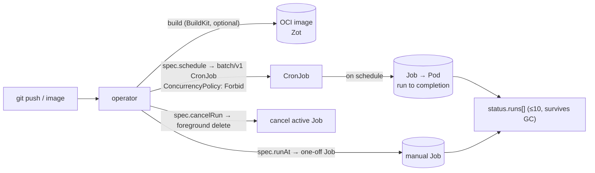

# Cron jobs (Render `cron_job` type)

bex runs scheduled tasks the way Render does: a `cron_job` service builds like any other service, then its image's command runs **on a cron schedule** to completion, with **at most one run active at a time** and a durable **run history**. It is the batch sibling of the compute service types — no Deployment, no Service, no Ingress, no HTTP port. Shipped across REST/GraphQL/MCP/Dashboard in **w1/m15** (the type) and **w2/m36** (first-class run history + trigger/cancel). This ADR consolidates the design that previously lived spread across [ADR006-bex-api.md](ADR006-bex-api.md) (the API surface), [ADR018-render-parity.md](ADR018-render-parity.md) (the parity row), and [render-artifacts/cron-runs.md](render-artifacts/cron-runs.md) (the pinned Render contract).

## The shape

- **Build** follows the shared build plane — a repo-backed cron builds an image with BuildKit, an image-backed cron uses the configured image directly. There is nothing cron-specific about the build.
- **Schedule** is a **5-field crontab** (`spec.schedule`, required for `cron_job`), evaluated by Kubernetes in **UTC** — matching Render's cron semantics exactly. bex-api **validates it with the same parser the Kubernetes CronJob controller uses** (`github.com/robfig/cron/v3`, `cron.ParseStandard`) on **both create and update** across all three surfaces (`validateTypeSpecificCreate` and `SetCronJob` share `validCronSchedule`), so "if bex accepts it, the CronJob accepts it." Before **w9/m91** the check only counted fields, so a malformed-but-5-field schedule like `99 99 * * *` passed bex-api and reached convergence, where the apiserver rejected the CronJob (minute/hour out of range) and flipped the App to `Failed` with no caller feedback — the QA-found bug this closed. The dashboard create and Settings forms range-check identically (`features/services/lib/cron.ts` `isValidCron`), show a live human-readable preview + "runs in UTC" note (`describeCron`), and pre-fill `*/5 * * * *` on the cron create deep link, matching Render's cron form.
- **Command** (`spec.command`, optional) overrides the image's default entrypoint (`/bin/sh -c <command>`, applied in `cronPodSpec`); empty runs the image's own command unmodified.
- **No network shape.** A `cron_job` reconciles to a `batch/v1` **CronJob** only — no Deployment/Service/Ingress. It therefore cannot carry `domains`, `healthCheckPath`, `maxShutdownDelaySeconds`, `ipAllowList`, or a `preDeployCommand` (all rejected with a named 400). It never appears in `GET /v1/services/{id}/instances` (returns `[]`).

## Mechanism (operator)

`reconcileCronJob` (`lego/operator/internal/controller/app_controller.go`) materializes and manages everything:

- **Scheduled runs** — a `batch/v1.CronJob` named after the App, with `ConcurrencyPolicy: ForbidConcurrent` (Render's "at most one run active" guarantee) and `spec.suspend = App.Spec.Suspended` (suspend pauses scheduling without dropping history). The pod template comes from `cronPodSpec` — the built image run to completion, no HTTP port.
- **Manual runs ("Trigger Run")** — a change to `spec.runAt` (a verb-as-timestamp field) creates a one-off `batch/v1.Job` with a deterministic name from `ManualCronRunJobName()`. Skipped while suspended, while cancellation is pending, or after that exact intent has already been handled. The internal acknowledgement does not mark an executing Job terminal.
- **Cancellation** — `spec.cancelRun` (a `CronRunCancellation` intent carried across the backend→operator boundary) triggers a **foreground delete** of the exact backing Job; the operator records `Canceled` in status and refuses to let a stable `runAt` recreate a canceled manual Job. A manual replacement waits until the foreground deletion removes the active Job, so there is never even a brief overlap.
- **Run history** — `cronRuns()` lists all Jobs labeled `app=<name>` (scheduled + one-off), sorts newest-first, maps Job conditions to a run status, and writes them to `App.status.runs` (capped at **10 entries**, retaining terminal entries after Kubernetes garbage-collects their Jobs until newer entries evict them). `Owns(&batchv1.CronJob{})` wires CronJob/Job events back into the reconcile queue.

## Twelve-hour execution bound (w5/m109)

[Render documents a twelve-hour active-run limit](https://render.com/docs/cronjobs#single-run-guarantee), with no manual exemption. Both the scheduled Job template and new manual Jobs set `spec.activeDeadlineSeconds=43200`; `backoffLimit=0` is unchanged. The deadline belongs to the Job, not its Pod template.

The operator also caps safely identified active Jobs while reading existing run history: scheduled Jobs must belong to the current CronJob UID, and manual Jobs must have the exact App owner and a known trigger identity. Existing shorter deadlines remain intact; terminal, deleting, foreign and unidentified Jobs are untouched. Older manual Jobs whose trigger identity cannot be recovered are not guessed. Adoption preserves `status.startTime`, so an already-overdue run can terminate promptly instead of receiving another twelve hours.

[Kubernetes counts from Job startTime](https://kubernetes.io/docs/reference/kubernetes-api/batch/job-v1/), when the controller begins processing it. This includes Pod scheduling and image-pull waits (inferred from that origin). A schedule waiting for an earlier run has no Job yet and consumes no deadline. Suspending the Job resets its clock on resume; Bex service suspension only suspends future CronJob scheduling, so existing Jobs continue aging. See [CronJob suspension](https://kubernetes.io/docs/concepts/workloads/controllers/cron-jobs/#schedule-suspension).

[Deadline expiry](https://kubernetes.io/docs/concepts/workloads/controllers/job/#job-termination-and-cleanup) yields Job `Failed` with reason `DeadlineExceeded`; controller processing and Pod termination grace can extend the wall-clock exit time. Run history waits for terminal `Failed`, not the earlier `FailureTarget`, and exposes the existing `unsuccessful` status on REST/GraphQL/MCP and Failed in the dashboard. Manual scheduling resumes after actual terminal observation. No user cancellation or success is fabricated, and the handled-trigger guard prevents timeout cleanup from replaying the manual run.

Research date: 2026-10-01. Render's exact origin, grace and timeout status remain undocumented, so this is a conservative Job-lifetime bound with an explicit timing uncertainty. Local evidence uses a temporary shortened deadline and proves the Kubernetes mechanism and surface outcome, not a twelve-hour wall-clock execution.

## CR contract

`App` (`lego/types/v1alpha1/app_types.go`, helpers in `cron.go`):

| Field | Meaning |
| --- | --- |
| `spec.type = "cron_job"` | selects the CronJob reconcile path |
| `spec.schedule` | 5-field crontab (required for `cron_job`) |
| `spec.command` | optional entrypoint override (`/bin/sh -c`) |
| `spec.runAt` | RFC3339 timestamp; a change triggers one manual run |
| `spec.cancelRun` | `CronRunCancellation` intent for an in-flight run |
| `status.manualRunHandledAt` | exact handled `spec.runAt` token; bounded internal replay guard, independent of public history |
| `status.runs[]` | `CronRun{ Name, StartedAt, FinishedAt, Status }`, newest first, ≤10 |

The mechanism-facing status vocabulary is `Running` / `Succeeded` / `Failed` / `Canceled`; bex-api maps it to Render's wire enum below.

## Manual intent acknowledgement (w5/m108)

A stable `spec.runAt` must not create the same manual run again after its Job disappears. The cancellation slot can be reused and the ten-entry history can evict the old run, so neither is a durable replay guard. `status.manualRunHandledAt` records one exact trigger token after its deterministic Job has been created or observed, or its cancellation accepted. An active Job still pauses scheduling; an absent acknowledged Job is not recreated. The marker never fabricates a terminal result or an evicted public history row. A fresh trigger has a different token and executes normally.

Acknowledgement persists with an optimistic status patch before cancellation deletes the Job or reconciliation replaces bounded history. A failed create cannot acknowledge an unexecuted trigger; a lost acknowledgement retries against the existing Job. A concurrent spec/status update conflicts instead of allowing stale acknowledgement to overwrite a newer one. Manual Jobs have no TTL; ordinary restart recovers from the retained Job. External removal of the Job between creation and the first persisted acknowledgement can still erase the only evidence, so this is not an exactly-once guarantee under arbitrary object deletion.

New manual Jobs also retain their trigger token as an internal annotation. If a newer trigger arrives before the prior Job reaches history, reconciliation identifies that earlier App-owned manual Job by owner and deterministic identity, and foreground-deletes it before creating the replacement. Unrelated App-owned Jobs are excluded. A known current legacy App-owned Job without a history row receives the same binding before acknowledgement. Other unmarked legacy Jobs continue relying on explicit cancellation/history; unrelated identities are not guessed.

Existing Apps adopt the acknowledgement from their current manual Job, matching observed history, or matching cancellation. When all three are already missing, an old trigger and an unhandled fresh trigger are indistinguishable. Migration retains the existing dispatch behavior in this ambiguous state, so an already-evicted legacy intent can still replay; age and observed generation are not proof of execution. An operator with external evidence can suspend the service, acknowledge that exact old token, and resume, or deliberately replace it with a new manual trigger. The fix prevents future loss of observed materialization; it cannot reconstruct evidence discarded before upgrade.

[Render's cron contract](https://render.com/docs/cronjobs#single-run-guarantee) and [cancel-current endpoint](https://api-docs.render.com/reference/cancel-cron-job-run), rechecked 2026-10-01, establish cancellation and single-run behavior. They do not specify history retention or internal acknowledgement storage. This guard is Bex correctness supporting cancellation parity, with unchanged REST/GraphQL/MCP/dashboard run shapes.

## API surface (one Core, three adapters)

`cron_job` rides the shared create/read/update verbs (`POST /v1/services` with `type: cron_job`, `serviceDetails.schedule`/`.command`; `PATCH` threads schedule/command via `SetCronJob`). Run management adds a dedicated verb family.

**REST** (`lego/backend/internal/apps/rest.go`):

| Method + path | Behavior | Source |
| --- | --- | --- |
| `POST /v1/cron-jobs/{id}/runs` | cancel any active run, then trigger a replacement; returns the pending `cronJobRun` (200) | Render's current contract |
| `DELETE /v1/cron-jobs/{id}/runs` | cancel the currently active run (204) | Render's current contract |
| `GET /v1/cron-jobs/{id}/runs` | list `[{cronJobRun, cursor}]` (`cursor`/`limit`) | bex extension |
| `GET /v1/cron-jobs/{id}/runs/{runId}` | fetch one stable `crr-…` run | bex extension |
| `POST /v1/cron-jobs/{id}/runs/{runId}/cancel` | cancel one pending run; terminal ⇒ 409 | bex extension |

The run handlers also remain available as `/v1/services/{id}/runs` subresources. The retired public `/v1/apps` family is not registered.

Run-now is one atomic backend intent, not a client-composed cancel followed by trigger. When history contains an active run, the same App patch sets `spec.cancelRun` for that exact Job and advances `spec.runAt`; the operator completes foreground deletion before materializing the replacement, so at-most-one remains true. A suspended cron rejects run-now with 409 after authorization but before billing or any patch, leaving both intent fields unchanged. Billing enforcement may reject run-now, while cancellation remains available so an already-running task can still be stopped.

**GraphQL**: `updateCronJob`, `runCronJob`, `cancelCronJobRun`, and queries `cronJobRuns(serviceId,cursor,limit)` / `cronJobRun(serviceId,runId)`, all returning `CronRun { id status startedAt finishedAt }`; `Service.lastSuccessfulRunAt` mirrors the REST cron detail.

**MCP**: `create_cron_job` (tracks Render's official create tool), plus the bex extensions `run_cron_job`, `list_cron_job_runs`, `get_cron_job_run`, `cancel_cron_job_run`, and `update_service(schedule:, command:)` for the schedule itself — bex's is functional where Render's official MCP shipped only a non-functional `update_cron_job` stub saying "use the dashboard/API" (and has since removed it); w1/m74 folded bex's into the service patch tool.

**Dashboard**: the cron Settings tab edits Schedule + Command; the Events page reads the cursor-paged run API and can cancel a pending row.

**Mobile** (w11/m8): the service companion card deliberately selects only opaque run id, normalized status, and start/finish timestamps. It cursor-pages history, links to the existing general service-log screen, and exposes confirmed run-now plus current-run cancel. It never selects the backing Job name, schedule, command, shell, or configuration mutations. Run-now stays available during an active run because the server owns cancel-and-replace, but is absent while suspended; cancel remains available for an active run even after suspension. Mutations are single-flighted and time-bounded, accepted outcomes poll exact-id history to convergence, and ambiguous outcomes lock both actions until a successful authoritative history refresh. Identity, workspace, service, and unmount boundaries abort or invalidate late results.

## Run object (Render contract, pinned)

`cronJobRun` — verified against Render's live OpenAPI 2026-07-14 ([render-artifacts/cron-runs.md](render-artifacts/cron-runs.md)):

| field | required | bex source |
| --- | :-: | --- |
| `id` | yes | deterministic `crr-…` derived from the backing Job name via `internal/id` |
| `status` | yes | `pending` \| `successful` \| `unsuccessful` \| `canceled` |
| `startedAt` | no | Job `status.startTime` |
| `finishedAt` | no | completion/failure transition or accepted-cancellation time |
| `triggeredBy` / `canceledBy` | no | **omitted** — Kubernetes Jobs do not retain the API caller identity |

The `crr-…` id hides the Kubernetes Job name while staying stable across reads and after Job GC. The cron service object reports `serviceDetails.lastSuccessfulRunAt` (REST) / `Service.lastSuccessfulRunAt` (GraphQL), derived from the newest successful `status.runs` entry.

## Deliberate divergences

- **First-class run history is a bex extension.** Render's current OpenAPI exposes no list-runs, get-run, or per-run-cancel routes — only trigger (`POST .../runs`) and cancel-current (`DELETE .../runs`). bex mirrors both current routes and adds the three historical reads in Render's own envelope/id/error grammar.
- **Terminal per-run cancel is 409, not a silent no-op.** Render's cancel-current OpenAPI documents only 204; a conflict is more honest than a successful no-op on an already-finished run.
- **Actor fields are omitted, not fabricated.** `triggeredBy`/`canceledBy` have no durable source (Jobs drop caller identity), so they are honestly absent.
- **Deadline timing is not established as exact Render parity.** Both scheduled and manual Jobs now have a twelve-hour Job deadline (w5/m109), including pending scheduling/image-pull time. Render does not document its timer origin, termination grace or timeout status. Cron services already reject persistent disks.
- **Not the same as one-off jobs.** Render's `/services/{id}/jobs` (run an arbitrary command in the service context) is an execution surface deliberately off-roadmap (`DO_NOT_DO` §pillar 5) — separate from scheduled cron jobs. Likewise **pre-deploy commands** are one-shot `batch/v1.Job`s gating a rollout ([ADR004-app-deployment.md](ADR004-app-deployment.md)), a different mechanism from a CronJob.

## Run visibility in the service Activity feed (w4/m118)

A cron run reaches `GET /services/{id}/events` (and its GraphQL/MCP twins) as `cron_job_run_started` / `cron_job_run_ended`, sourced from the **observed facts** the reconciler projects out of `status.runs` — never from the intent verbs (`apps.TriggerCronRun`, `apps.CancelCronRun`, `apps.CancelCurrentCronRun`).

That distinction is the whole design. `recordCronRunFacts` explicitly "does not special-case how a run was requested", so scheduled and manual runs both produce facts, and only the ended fact carries the terminal status (`succeeded|failed|canceled`). Mapping the verbs _as well_ would show every manual run twice — the same argument that keeps `deploys.Trigger` out of the vocabulary, since the deploys row it opens **is** the `deploy_started` event. Outbound webhooks had already settled it this way (`TestCronWebhookEventsComeFromObservedFactsNotIntentVerbs`); until w4/m118 the events feed had it exactly backwards — verbs mapped, facts missing from `allFactTypes` — so a schedule that started and failed on its own was **invisible in Activity** while Recent Runs, webhooks and push all reported it (live 2026-09-19: an every-minute cron whose first run failed after 10m 54s of crash-loop backoff showed only its two deploy events).

The "who asked" record is not lost: it stays in the workspace audit log, which is where the other deliberately-unmapped verbs put it. No Render divergence — Render's vocabulary has these two types and no separate "someone pressed trigger" event.

## Evidence

`cron_runs_test.go`, `service_types_test.go` (envtest), `cron-runs-section.test.tsx`, `events/service_test.go` (`TestScheduledCronRunReachesTheFeed`, `TestManualCronRunIsNotCountedTwice`) + `events/lifecycle_vocab_test.go` (`TestCronRunEventsComeFromObservedFactsNotIntentVerbs`); parity row [ADR018-render-parity.md](ADR018-render-parity.md) (Cron job); milestone `.pm/w1/done/m15` + `w2/m36`.
